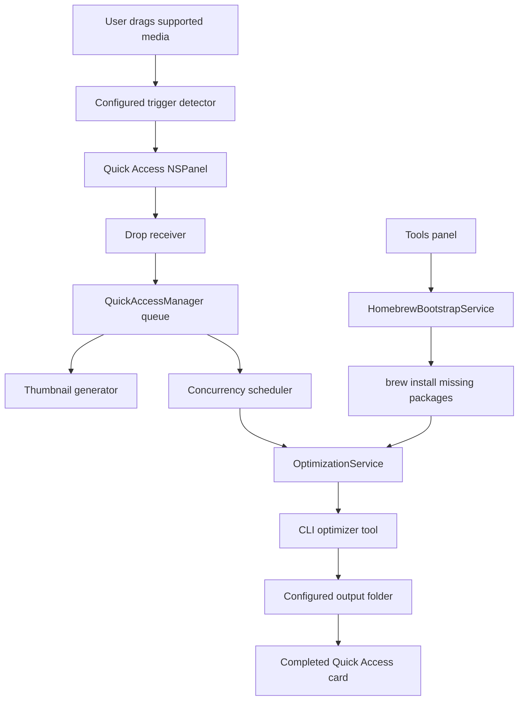

# Project Structure

This doc mirrors current Droplit code, not the old Snapzy source docs.

## Runtime Map



## Source Tree

```text
Droplit/
  App/
    AppDelegate.swift

  Features/
    QuickAccess/
      Components/
        QuickAccessCardView.swift
        QuickAccessDropReceiverView.swift
        QuickAccessDropZoneCardView.swift
        QuickAccessStackView.swift
      Managers/
        QuickAccessManager.swift
        QuickAccessPanelController.swift
      Models/
        QuickAccessModels.swift
      Services/
        QuickAccessAnimations.swift
        QuickAccessShakeDetector.swift
        QuickAccessThumbnailGenerator.swift
      QuickAccessPanel.swift

  Services/
    Optimization/
      OptimizationOutputSettings.swift
      OptimizationService.swift

  Support/
    ScreenUtility.swift

  ContentView.swift
  DroplitApp.swift

scripts/
  build_and_run.sh

.codex/
  environments/
    environment.toml
```

## Feature Roots

| Path | Owns |
| --- | --- |
| `App/` | App lifecycle and launch-time service bootstrap |
| `Features/QuickAccess/` | Floating stack, placeholder card, drag/drop, card visuals, trigger detection |
| `Services/Optimization/` | Local CLI tool resolution, Homebrew bootstrap, optimizer process execution |
| `Support/` | Small platform helpers |

## Quick Access Flow

1. `AppDelegate` starts `QuickAccessManager`.
2. `QuickAccessManager` listens to local/global drag events.
3. `QuickAccessManager` checks the active drag pasteboard for supported optimizer payloads, then evaluates the configured trigger interaction.
   Default is shake via `QuickAccessShakeDetector`; hold starts a timer using the configured delay.
4. `QuickAccessPanelController` shows a non-activating floating `NSPanel`.
5. The placeholder stays pinned while the drag session is active.
6. If the user releases without dropping, the placeholder hides after a short grace period.
7. `QuickAccessDropReceiverView` reads file URLs or image/PDF pasteboard data.
8. `QuickAccessManager` keeps the panel visible while the placeholder becomes a processing card.
9. `QuickAccessManager` inserts queued cards for all supported dropped files.
10. The concurrency scheduler starts up to the configured number of optimization jobs.
11. Extra jobs remain queued until an active job completes, fails, or is removed.
12. `OptimizationService` writes optimized output to configured output folder.
13. If no folder configured, output defaults to Desktop.
14. Swipe a Quick Access result card left or right to dismiss that card.
15. Double-click a card to open the optimized output, falling back to the source file when output is unavailable.
16. Completed Quick Access cards stay visible for 15 seconds, then auto-hide.
17. The floating Quick Access stack shows the newest cards plus an overflow summary when the queue is larger than the panel should display.

Output folder is changed from main window Output configuration.
Parallel job count is changed from main window Concurrency configuration.

## Homebrew Bootstrap Flow

1. `ContentView` renders optimizer availability from `OptimizationTool.catalog`.
2. `HomebrewBootstrapService` checks for `brew` in the local tool search paths.
3. If tools are missing, the Tools panel install action runs:

```text
brew install <missing-packages>
```

4. After install completes, the Tools panel refreshes availability state.

## Optimizer Mapping

| Input | Tool | Homebrew package |
| --- | --- | --- |
| PNG | `pngquant` | `pngquant` |
| JPEG | `jpegoptim` | `jpegoptim` |
| GIF | `gifsicle` | `gifsicle` |
| Video | `ffmpeg` | `ffmpeg` |
| PDF | `gs` | `ghostscript` |
| Other images | `vips` | `vips` |
| Video to GIF | `gifski` | `gifski` |

## Notes

- The app intentionally disables App Sandbox for now so local optimizer binaries can execute.
- Missing optimizer binaries surface as failed Quick Access cards.
- `gifski` is shown in tool availability, but video-to-GIF conversion is not wired into the first optimization flow yet.
